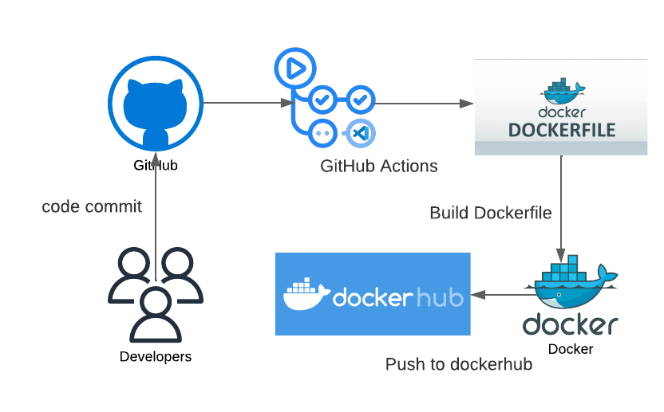

# workflow-github-actions
Build & Push Docker Image to DockerHub using GitHub Actions | Docker containers with GitHub Actions

*Project development stages:

•	Create GitHub actions workflow

- Checkout source code
- Login to Dockerhub 
- Build docker image and push to Dockerhub

•	Add Dockerhub username and password in GitHub actions secrets

Technologies used in this project:
-	GitHub actions
-	Docker
